セイラビリティ東京は、ハンザ（アクセスディンギー）を通してセーリングの普及を目指しています。年齢や障がいの有無、経験は問いません。誰もが水辺を楽しめる活動です。

東京都内で定期的にイベントを開いています。初めてセーリングに挑戦したい方や、活動を手伝ってくださる仲間を募集しています。

Sailability Tokyo embraces the principle of sailing for everyone, no experience necessary. With or without disabilities, young and old. All are welcome! We hold regular events in Tokyo and welcome those who would like to come and learn how to sail. We are looking for people to support our activities.

## セイラビリティ活動について

### セイラビリティ活動とは

セイラビリティ（Sailability）活動は、ユニバーサルデザインのヨット「アクセスディンギー」で、海や湖に親しむクラブ活動です。

始まりは1980年代のイギリスです。障がいのある人にもセーリングを楽しんでもらうため、王立ヨット協会（RYA）が中心となって始めました。1991年にはオーストラリアへ伝わり、アクセスディンギーによる「誰でもできるセーリング」の運動と一つになりました。

アクセスディンギーの設計者クリス・ミッチェルさんは「Sailing for Everyone（みんなのためのセーリング）」を提唱しました。この理念のもと、障がいや年齢、経験に関係なく誰もが楽しめる活動として、世界各国に広がっています。

活動はオーストラリアのほか、イギリス・アメリカ・フランス・オランダなどの欧米諸国、中国・インド・マレーシア・フィリピン・シンガポール・日本などのアジア諸国で行われています。アクセスディンギーは2013年に「ハンザ」と改名し、ハンザクラスとして位置づけられています。

### セイラビリティ活動とセーリングの普及

一般の方にアクセスディンギーに乗っていただき、ヨットの楽しさや海の素晴らしさを知ってもらうことを大切にしています。

ヨットには「危ない」「怖い」「お金がかかる」というイメージがあり、敬遠されがちです。私たちは、誰も差別しない海と風と太陽を、多くの人に満喫してもらいたいと考えています。

健常者も障がいのある人も、子どもも高齢者も、男女の区別なく一緒にセーリングを楽しむ。そのことを通して、心身ともに健康な社会づくりに役立つことを目指しています。

アクセスディンギーの一番の魅力は、操作が簡単で、安全に配慮された設計であることです。障がいのある人も高齢者も、子どもも大人も一緒に楽しめます。ヨットの経験がない人も、安心してセーリングを体験できます。

セーリングの体験を通して、積極性や協調性、集中力、忍耐力、思いやり、チャレンジ精神などを自然に学べます。環境にやさしいセーリングへの理解が深まり、ヨットを楽しむ人の輪が広がることを期待しています。

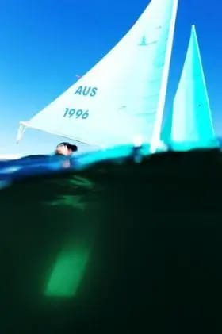

## ハンザの安全性と安定性

ハンザには、走りを安定させるためのセンターボードがあります。センターボードの下部には鉛のおもり（バラスト）が入っています。このおもりが帆にあたる風の力を抑え、船をまっすぐ進ませるとともに、転覆を防ぐ復元力になります。

センターボードは取り外しができます。海の上では、必ず一番下まで降ろしてピンで固定してください。これが最も重要な点です。固定したセンターボードは「キール」と呼ばれます。その意味で、**ハンザはディンギーではなくキールボート**です。これはハンザの安定と安全を支える、設計上の大きな特徴です。

ハンザの船底はV字の形をしていて、安定性を高めています。丸く平らな船底は安定性がなく、おもりを増やす必要があります。キールボートは、キールの先端を重くすることで必要な復元力を得ます。ハンザの船底は縦方向にV字の形になっていて、重心を前にすることで風と波の力をやわらげ、前に進む形になっています。

キール（おもり）は船体から取り外せます。そのため、船を水に出すときや引き上げるときに、船底に出っ張りがありません。キールはシーソーのように働きます。シーソーの反対側はマストとセール（帆）です。船が傾くとキールの鉛のおもりが持ち上がり、傾くほど船を元に戻す力が強くなります。

風に押されて船が傾くと、セールに風があたる面積が小さくなります。そのため力がつり合い、強い風でも船は起き上がって安定します。

キールボートは、転覆したりマストやセールが海に浸かったりしないように設計されています。ただし、乗る人の体重のかけ方によっては、このシーソーの働きが効かなくなります。体がストラップなどで船とつながっていたり、船の高い位置にいたりすると、安定性が悪くなり転覆することがあります。

そのため、船の上ではできるだけ体を低くしてください。ハンザ2.3と303の座席の改造や変更はおすすめしません。2.3と303のワイドシートのモデルでは、体を座席にストラップなどでつながないでください。

ハンザLiberty、2.3、303のシングルモデルは、デッキが広く、上の部分が浮力になっています。これには、船を浮かせることと、乗る人が安全に座れるようにすることの2つの目的があります。座席（コックピット）のふち（コーミング）の浮力は、船の中央のキールから離れているため、てこの原理で強い復元力になります。小さな船でもトラブルのない、使いやすく安全なヨットにするための工夫です。

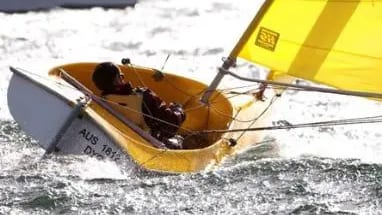
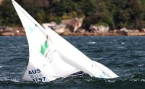
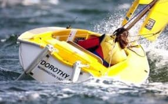
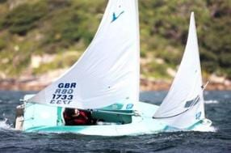

### 安全の3原則

1. 常にライフジャケット（救命胴衣）を着ける
2. キールは常に一番下まで降ろして固定する（転覆したときにキールが抜けないように）
3. 乗る人の体の状態や力に合わせて、帆を小さくする（リーフ）

初心者の段階では、ハンザ303ワイドを使います。穏やかで安全な水面で、経験豊富なインストラクターと一緒に短い距離を走ります。安全の3原則を守り、事故のないよう万全を期しましょう。

次の段階では、少し冒険になりますが、障がいのある人がひとりで帆走することをおすすめします。

最終的な段階では、2人乗りのハンザで、ひとりで、またはヘルム（舵取り）やクルーとして競技に出ます。上達しても油断せず、安全の3原則を守りましょう。

### 乗る人・インストラクター・スタッフ全員が知っておくこと

#### 1. ライフジャケットを着けること

ライフジャケットは、口と鼻が水面より上に出るように着けます（股ひもを付けてください）。承認されたものでも、正しく着けないと機能しないことがあります。

重い障がいのある人が転覆で船から投げ出される可能性も考え、被害を最小限にする準備をしてください。障がいのある人は、体重が動かないように座席の低い位置に座ります。船の復元力をさまたげないためです。乗る人をストラップで船に固定したり、ひとりにしたりしないでください。

#### 2. キールを一番下まで降ろし、ピンで固定するまで出艇しないこと

スロープから水面に出るときは、キールを一番下まで降ろしてピンで固定します。帆走中も、キールは一番下で固定したままにします。船はしっかり管理し、装備を整えてください。

長いピンは、2.3、303、Libertyでキールを固定する標準の部品です。ピンが正しく入っているかを確かめる手順があります。追加の安全対策として、ショックコードでも固定することをおすすめします。

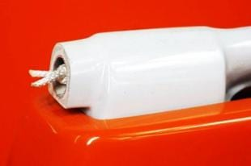
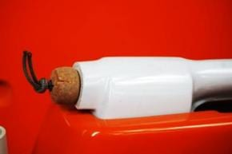
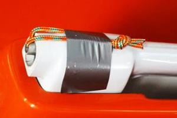
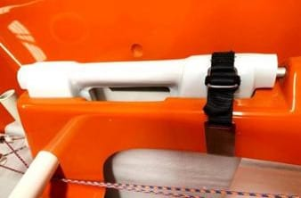

#### 3. ローラーファーリング（巻き取り式）のリーフ（縮帆）はハンザの特徴です

ほとんどのヨットはリーフができますが、ハンザほど簡単で効率的なものはありません。この仕組みを生かすには、正しい艤装（ぎそう）と手入れが必要です。乗る人も、事前に使い方を覚えておきます。

乗る人が自分でリーフできない場合は、経験者がリーフと巻き戻しの方法を覚え、初心者が自信を持てるまで何度か教えましょう。多くの場合、1回転巻くだけでセールにあたる風の力を逃がせます。

乗る人が座席に縛り付けられていると、自分でリーフできません。事前に経験者に相談してください。リーフが必要なときや、明らかに必要な状況では、しっかり見守ることが大切です。

<figure>

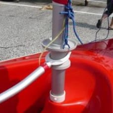

<figcaption>ハンザ303のローラーファーリング</figcaption>
</figure>
<figure>

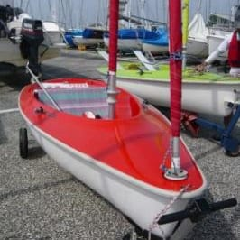

<figcaption>ハンザ303のローラーファーリング</figcaption>
</figure>
<figure>

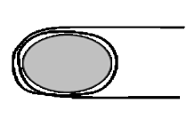

<figcaption>正しいジブセールの取り付け</figcaption>
</figure>
<figure>

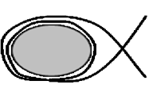

<figcaption>間違ったジブセールの取り付け</figcaption>
</figure>

<small>TELLTALE September 2019 Volume 19（原文）とセイラビリティ東京活動マニュアルより要約（日本語訳 JMF）</small>
